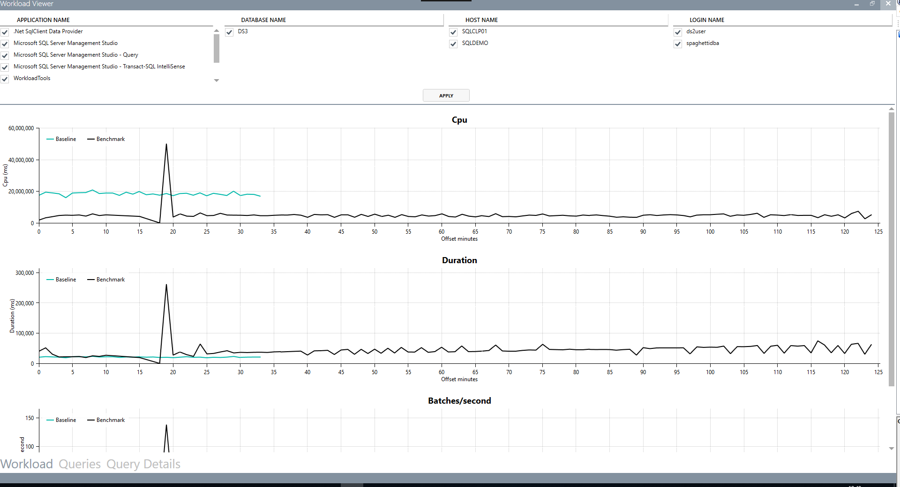
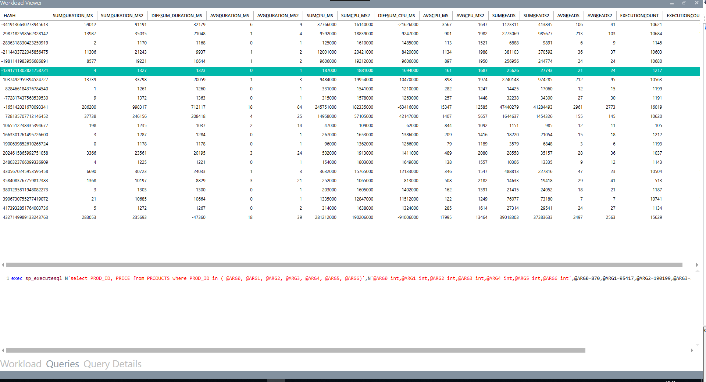

# WorkloadTools

*WorkloadTools is a collection of tools to collect, analyze and replay SQL Server workloads, on premises and in the cloud .*

## SqlWorkload

SqlWorkload is a command line tool to start workload collection, analyze the collected data and replay the workload to a target machine, all in real-time.

SqlWorkload can connect to a SQL Server instance and capture execution related events via SqlTrace or Extended Events. These events are processed and passed to "consumers" that can replay the events to a target instance in real-time and analyze the statements. 
All the batches are "normalized" (parameters and constants are stripped away) and metrics are calculated on each normalized batch, like cpu, duration, reads and writes.

During the analysis, additional metrics are captured and saved regularly to the analysis database:

- cpu usage
- wait stats

### Replaying and analyzing a production workload in test

If you want to compare the execution of the same workload on two different machines, you can point a first instance of SqlWorkload to your production server: SqlWorkload will analyze the workload and write the metrics to a database of your choice.
It will also replay the workload to a test server, where you can point a second instance of SqlWorkload to obtain the same metrics. This second instance of SqlWorkload will not perform the replay, but it will only perform the workload analysis and write it to the same database where you stored the metrics relative to production (possibly on a different schema).

Once you have captured and replayed the workload for a representative enough time, you can stop the two instances of SqlWorkload and analyze the data using the included PowerBI report.

### Command line switches

SqlWorkload accepts a single command line switch:

`--File` Path to the `.JSON` configuration file

In fact, SqlWorkload supports a multitude of parameters and specifying them all in the command line can become really tedious. For this reason, SqlWorkload supports `.JSON` configuration files.

Here is the list of the parameters that can be supplied in the configuration file:

```TEXT
{
    // This section is fixed
    "Controller": {

        // The Listener section describes how to capture the events
        "Listener":
        {
            // The main parameter here is the class type of the Listener
            // At the moment, three Listener types are supported
            // - ExtendedEventsWorkloadListener
            // - SqlTraceWorkloadListener
            // - ProfilerWorkloadListener
            "__type": "ExtendedEventsWorkloadListener",

            // For each Listener type you can supply your own script
            // to customize the SqlTrace definition or the XE session
            // definition. If you omit this parameter, the default
            // definition will be used, which is fine 99% of the time.
            "Source": "Listener\\ExtendedEvents\\sqlworkload.sql",

            // The ConnectionInfo describes how to connect the Listener
            "ConnectionInfo":
            {
                "ServerName": "SQLDEMO\\SQL2014",
                // If you omit the UserName/Password, Windows authentication
                // will be used
                "UserName": "sa",
                "Password": "P4$$w0rd!"
            },

            // Filters for the workload
            // These are not mandatory, you can omit them
            // if you don't need to filter.
            // Prepend the '^' character to exclude the value
            "DatabaseFilter": "DS3",
            "ApplicationFilter" : "SomeAppName",
            "HostFilter" : "MyComputer",
            "LoginFilter": "sa"
        },

        // This section contains the list of the consumers
        // The list can contain 0 to N consumers of different types
        "Consumers":
        [
            {
                // This is the type of the consumer
                // Three types are available at the moment:
                // - ReplayConsumer
                // - AnalysisConsumer
                // - WorkloadFileWriterConsumer
                "__type": "ReplayConsumer",

                // The same considerations for ConnectionInfo
                // valid for the Listener apply here as well
                "ConnectionInfo":
                {
                    "ServerName": "SQLDEMO\\SQL2016",
                    "DatabaseName": "DS3",
                    "UserName": "sa",
                    "Password": "P4$$w0rd!"
                }
            },
            {
                // Here is another example with the AnalysisConsumer
                "__type": "AnalysisConsumer",

                // ConnectionInfo
                "ConnectionInfo": 
                {
                    "ServerName": "SQLDEMO\\SQL2016",
                    "DatabaseName": "DS3",
                    // This "SchemaName" parameter is important, because it 
                    // decides where the analysis data is written to
                    "SchemaName": "baseline",
                    "UserName": "sa",
                    "Password": "P4$$w0rd!"
                },

                // This decides how often the metrics are aggregated and 
                // written to the target database
                "UploadIntervalSeconds": 60
            }
        ]
    }
}
```

## WorkloadViewer

WorkloadViewer is a GUI tool to analyze the data collected by the WorkloadAnalysisTarget in a SQL Server database. It shows metrics about the workload, relative to the beginning of the capture (in minutes).

Here are some screenshots of WorkloadViewer. 

### Workload

The three charts in the "Workload" tab show an overview of the workload analysis: CPU, Duration and Batches/sec. Two workloads can be compared by displaying independent series (Baseline and Benchmark) for each workload.



### Queries

This tab displays information about the queries and how they relate to the workload. For a single workload analysis, it shows the most expensive queries. When comparing two workloads, it can be used to identify query regressions.



### Query Details

Double clicking a query in the "Queries" tab takes you to the "Query Details" tab, where you can see the text of the selected query, specific statistics by application, database, host and login and the average duration in a chart.


## ConvertWorkload

ConvertWorkload is a command line tool to convert existing trace files to the internal SQLite format used by WorkloadTools. In the future, ConvertWorkload will also support conversion from existing Extended Events files.

Why converting trace file to a different intermediate format instead of supporting it directly? Trace files can be read using an API that works only in x86. While WorkloadTools **can** work in x86, using x64 builds is highly recommended, due to the possible high memory usage when capturing intensive workloads. Using a x86 API would have excluded the functionality from the x64 builds, hence using an external tool to convert trace files seems much more appropriate.

### Command line switches

```text
-I or --Input               The input file (trace or extended events) to convert

-O or --Output              The output SQLite file to write

-L or --Log                 Specifies where to save the log file

-A or --ApplicationFilter   Application filter to apply while converting the source file

-D or --DatabaseFilter      Database filter to apply while converting the source file

-H or --HostFilter          Host filter to apply while converting the source file

-U or --LoginFilter         Login filter to apply while converting the source file
```