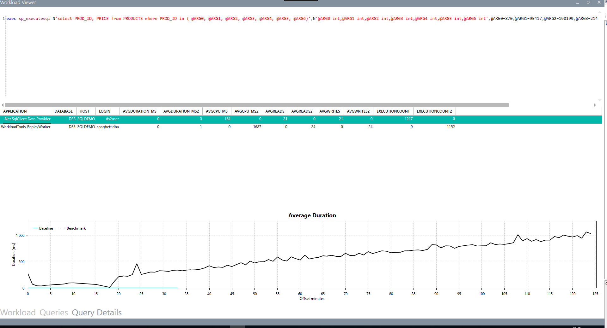

# WorkloadTools

*WorkloadTools is a collection of tools to collect, analyze and replay workloads on a SQL Server instance.*

## SqlWorkload

SqlWorkload is a command line tool to start workload collection, analyze the collected data and replay the workload to a target machine, all in real-time.

SqlWorkload can connect to a SQL Server instance and capture execution related events via SqlTrace or Extended Events. These events are processed and passed to "consumers" that can replay the events to a target instance in real-time and analyze the statements. 
All the batches are "normalized" (parameters and constants are stripped away) and metrics are calculated on each normalized batch, like cpu, duration, reads and writes.

During the analysis, additional metrics are captured and saved regularly to the analysis database:

- cpu usage
- wait stats

### Replaying and analyzing a production workload in test

If you want to compare the execution of the same workload on two different machines, you can point a first instance of SqlWorkload to your production server: SqlWorkload will analyze the workload and write the metrics to a database of your choice.
It will also replay the workload to a test server, where you can point a second instance of SqlWorkload to obtain the same metrics. This second instance of SqlWorkload will not perform the replay, but it will only perform the workload analysis and write it to the same database where you stored the metrics relative to production (possibly on a different schema).

Once you have captured and replayed the workload for a representative enough time, you can stop the two instances of SqlWorkload and analyze the data using the included PowerBI report.

### Command line switches

SqlWorkload accepts a single command line switch:

`--File` Path to the `.JSON` configuration file

In fact, SqlWorkload supports a multitude of parameters and specifying them all in the command line can become really tedious. For this reason, SqlWorkload supports `.JSON` configuration files.

Here is the list of the parameters that can be supplied in the configuration file:

```TEXT
{
    // This section is fixed
    "Controller": {

        // The Listener section describes how to capture the events
        "Listener":
        {
            // The main parameter here is the class type of the Listener
            // At the moment, three Listener types are supported
            // - ExtendedEventsWorkloadListener
            // - SqlTraceWorkloadListener
            // - ProfilerWorkloadListener
            "__type": "ExtendedEventsWorkloadListener",

            // For each Listener type you can supply your own script
            // to customize the SqlTrace definition of the XE session
            // definition. If you omit this parameter, the default
            // definition will be used, which is fine 99% of the time.
            "Source": "Listener\\ExtendedEvents\\sqlworkload.sql",

            // The ConnectionInfo describes how to connect the Listener
            "ConnectionInfo":
            {
                "ServerName": "SQLDEMO\\SQL2014",
                // If you omit the UserName/Password, Windows authentication
                // will be used
                "UserName": "sa",
                "Password": "P4$$w0rd!"
            },

            // Filters: for the workload
            // These are not mandatory, you can omit them
            // if you don't need to filter.
            // Prepend the '^' character to exclude the value
            "DatabaseFilter": "DS3",
            "ApplicationFilter" : "SomeAppName",
            "HostFilter" : "MyComputer",
            "LoginFilter": "sa"
        },

        // This section contains the list of the consumers
        // The list can contain 0 to N consumers of different types
        "Consumers":
        [
            {
                // This is the type of the consumer
                // Two types are available at the moment:
                // - ReplayConsumer
                // - AnalysisConsumer
                "__type": "ReplayConsumer",

                // The same considerations for ConnectionInfo
                // valid for the Listener apply here as well
                "ConnectionInfo":
                {
                    "ServerName": "SQLDEMO\\SQL2016",
                    "DatabaseName": "DS3",
                    "UserName": "sa",
                    "Password": "P4$$w0rd!"
                }
            },
            {
                // Here is another example with the AnalysisConsumer
                "__type": "AnalysisConsumer",

                // ConnectionInfo
                "ConnectionInfo": 
                {
                    "ServerName": "SQLDEMO\\SQL2016",
                    "DatabaseName": "DS3",
                    // This "SchemaName" parameter is important, because it 
                    // decides where the analysis data is written to
                    "SchemaName": "baseline",
                    "UserName": "sa",
                    "Password": "P4$$w0rd!"
                },

                // This decides how often the metrics are aggregated and 
                // written to the target database
                "UploadIntervalSeconds": 60
            }
        ]
    }
}
```

## Screenshots

Here are some screenshots of the PowerBI report included with the tool. It can be hooked to the statistics database via Direct Query

### Overview of the analysis

The top filters can be used to restrict the analysis to a particular database  or application or host name.

The time slicer can filter the charts to a particular date.


### Regressed Queries

This table shows the queries that have regressed in the replay compared to the baseline.


### Query Detail

Drilling on one the regressed queries will bring you to the query detail page, where you can see the text of the query (but not copy it to the clipboard - thanks PowerBI) and the stats broken down by application name, database name, host name and login name.


